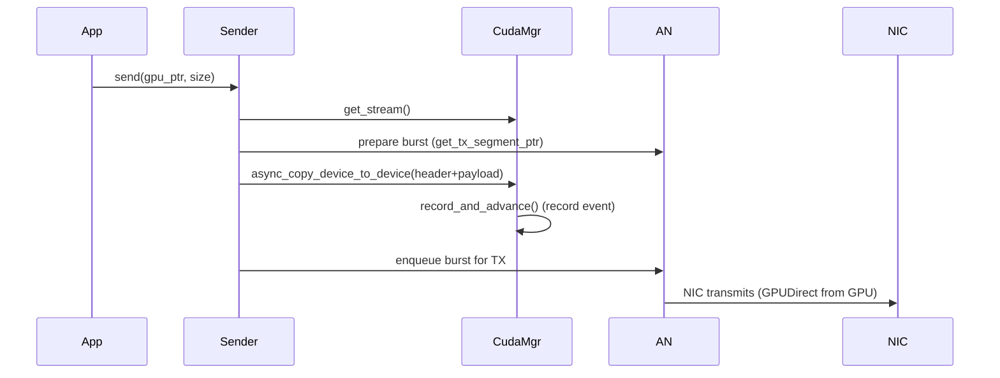
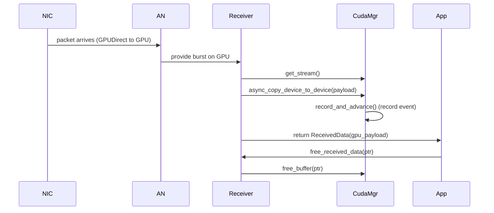

# Connext Common Library

Shared utilities for Holoscan connext applications with GPU Direct networking.

## Overview

This library provides a high-level facade for GPU Direct network transmission using DPDK and CUDA, abstracting away low-level packet construction and hardware details.

## Architecture

This section provides a compact visual overview of how the Connext common library components fit together and the transmit/receive data flows. The diagrams use Mermaid syntax and can be rendered on GitHub or in most Markdown renderers that support Mermaid.

### High-level Architecture

```mermaid
flowchart LR
  App[Holoscan App] -->|uses| Sender[IGpuDirectNetworkSender]
  App -->|uses| Receiver[IGpuDirectNetworkReceiver]
  Sender -->|subsystems| CudaMgr[CudaResourceManager]
  Receiver -->|subsystems| CudaMgr
  Sender -->|DPDK/ANO| AN[Advanced Network (DPDK) / NIC]
  Receiver -->|DPDK/ANO| AN
  CudaMgr -->|manages| GPU[GPU (device memory, streams, events)]
  AN -->|GPUDirect| GPU
```

*Figure: High-level architecture — application, facades, CUDA manager, and Advanced Network (DPDK)/NIC with GPUDirect path.*

### TX (Transmit) Sequence



*Figure: TX flow — application → sender facade → CUDA manager/Advanced Network → NIC (GPUDirect).* 

### RX (Receive) Sequence



*Figure: RX flow — NIC → Advanced Network → receiver facade → CUDA manager → application (caller frees buffer).* 

## Public API

### GPU Direct Network Sender

The main public interface is `IGpuDirectNetworkSender`, a facade that encapsulates all CUDA, DPDK, and packet construction details for network transmission.

#### Features

- **Zero-copy transmission**: GPU → NIC via GPUDirect (no CPU involvement)
- **Simple API**: Single `send()` call with void* GPU pointer
- **Automatic packet construction**: Ethernet + IP + UDP headers built automatically
- **Async CUDA operations**: Event-based flow control for optimal throughput
- **Statistics tracking**: Packets sent, bytes transmitted, frames dropped
- **Exception-based errors**: Clear exception hierarchy for error handling

#### Basic Usage

```cpp
#include <gpu_direct_network_sender.h>
#include <sender_config.h>
#include <gpu_direct_exceptions.h>

// 1. Configure the sender
SenderConfig config;
config.interface_name = "loopback_ports";  // From advanced_network config
config.queue_id = 0;                        // TX queue ID
config.ip_src_addr = "192.168.10.10";
config.ip_dst_addr = "192.168.10.11";
config.eth_dst_addr = "3c:6d:66:11:91:56"; // Destination MAC
config.udp_src_port = 4096;
config.udp_dst_port = 4096;
config.header_size = 64;                    // Including padding
config.max_packet_size = 1064;              // Total packet size

// Validate configuration (throws InvalidConfigException)
config.validate();

// 2. Create sender instance (throws on initialization errors)
auto sender = IGpuDirectNetworkSender::create(config);

// 3. Transmit data in your compute loop
void* gpu_data = /* your CUDA device pointer */;
size_t data_size = 1000;  // Bytes to send

try {
  if (sender->is_ready()) {
    sender->send(gpu_data, data_size);
    HOLOSCAN_LOG_INFO("✓ Sent {} bytes", data_size);
  } else {
    // Previous batch still in flight, skip this frame
    HOLOSCAN_LOG_DEBUG("Skipping frame - sender not ready");
  }
} catch (const NotReadyException& e) {
  HOLOSCAN_LOG_ERROR("Send failed: {}", e.what());
}

// 4. Check statistics
auto stats = sender->get_stats();
HOLOSCAN_LOG_INFO("Total: {} packets, {} bytes, {} dropped",
                  stats.packets_sent, stats.bytes_transmitted, stats.frames_dropped);
```

#### API Reference

**Configuration**
```cpp
struct SenderConfig {
  std::string interface_name;  // NIC interface from advanced_network config
  uint16_t queue_id;           // TX queue ID (must match advanced_network)
  std::string ip_src_addr;     // Source IPv4 (e.g., "192.168.10.10")
  std::string ip_dst_addr;     // Destination IPv4 (e.g., "192.168.10.11")
  std::string eth_dst_addr;    // Destination MAC (e.g., "AA:BB:CC:DD:EE:FF")
  uint16_t udp_src_port;       // UDP source port
  uint16_t udp_dst_port;       // UDP destination port
  uint16_t header_size;        // Header size including padding (≥42)
  uint16_t max_packet_size;    // Maximum packet size including headers
  
  void validate();  // Throws InvalidConfigException if invalid
};
```

**Sender Interface**
```cpp
class IGpuDirectNetworkSender {
 public:
  // Send GPU buffer to network (silently truncates if size > max_payload_size)
  virtual void send(void* gpu_data, size_t size) = 0;
  
  // Check if ready for transmission (previous batch completed)
  virtual bool is_ready() const = 0;
  
  // Get maximum payload size (max_packet_size - header_size)
  virtual size_t max_payload_size() const = 0;
  
  // Get cumulative statistics
  virtual TransmissionStats get_stats() const = 0;
  
  // Reset statistics counters
  virtual void reset_stats() = 0;
  
  // Factory method to create sender
  static std::unique_ptr<IGpuDirectNetworkSender> create(const SenderConfig& config);
};
```

**Statistics**
```cpp
struct TransmissionStats {
  uint64_t packets_sent;        // Total packets transmitted
  uint64_t bytes_transmitted;   // Total payload bytes transmitted
  uint64_t frames_dropped;      // Frames skipped due to not-ready state
};
```

#### Exception Hierarchy

```cpp
// Base exception
class GpuDirectException : public std::runtime_error;

// Configuration errors (thrown during validation or create())
class InvalidConfigException : public GpuDirectException;

// Network initialization errors (thrown during create())
class NetworkInitException : public GpuDirectException;

// CUDA errors (thrown during create() or send())
class CudaInitException : public GpuDirectException;

// Runtime errors (thrown during send())
class NotReadyException : public GpuDirectException {
  size_t batch_index;  // Which batch is still in flight
};
```

#### Thread Safety

**NOT thread-safe**. Use each sender instance from a single thread only.

#### GPU-Only Mode

The sender operates in **GPU-only mode** (no header-data split):
- Entire packet (headers + payload) resides on GPU
- Zero CPU copies during transmission
- Requires DPDK GPUDirect support

#### Configuration Constraints

- `header_size` must be ≥ 42 bytes (Ethernet + IP + UDP minimum)
- IP TTL is hardcoded to 64
- Concurrent batches internally set to 4
- Payload truncated if `size > max_payload_size()`

### GPU Direct Network Receiver

The companion interface is `IGpuDirectNetworkReceiver`, which provides a symmetric facade for GPU Direct network reception.

#### Features

- **Zero-copy reception**: NIC → GPU via GPUDirect (no CPU involvement)
- **Simple API**: Single `receive()` call returns GPU pointer
- **Automatic header stripping**: Ethernet + IP + UDP headers removed automatically
- **Multi-queue polling**: Facade handles polling all RX queues internally
- **Async burst cleanup**: DPDK bursts freed when CUDA operations complete
- **Statistics tracking**: Packets received, bytes received, polls attempted, empty polls
- **Exception-based errors**: Same exception hierarchy as sender

#### Basic Usage

```cpp
#include <gpu_direct_network_receiver.h>
#include <receiver_config.h>
#include <gpu_direct_exceptions.h>

// 1. Configure the receiver
ReceiverConfig config;
config.interface_name = "rx_port";       // From advanced_network config
config.header_size = 64;                 // Including padding
config.max_packet_size = 1064;           // Total packet size
config.gpu_device = 0;                   // GPU device ID

// Validate configuration (throws InvalidConfigException)
config.validate();

// 2. Create receiver instance (throws on initialization errors)
auto receiver = IGpuDirectNetworkReceiver::create(config);

// 3. Receive data in your compute loop
auto received = receiver->receive();

if (received.has_value()) {
  auto& data = received.value();
  void* gpu_payload = data.gpu_payload;    // GPU buffer with payload
  size_t bytes = data.payload_bytes;       // Payload size (no headers)
  
  // Use the GPU data (e.g., create DLPack tensor)
  // ... your processing code ...
  
  // IMPORTANT: Caller must free the GPU buffer
  receiver->free_received_data(gpu_payload);
  
  HOLOSCAN_LOG_INFO("✓ Received {} bytes", bytes);
} else {
  // No data available this cycle
}

// 4. Check statistics
auto stats = receiver->get_stats();
HOLOSCAN_LOG_INFO("Received: {} packets, {} bytes, {} polls ({} empty)",
                  stats.packets_received, stats.bytes_received,
                  stats.polls_attempted, stats.empty_polls);
```

#### API Reference

**Configuration**
```cpp
struct ReceiverConfig {
  std::string interface_name;  // NIC interface from advanced_network config
  uint16_t header_size;        // Header size including padding (≥42)
  uint16_t max_packet_size;    // Maximum packet size including headers
  int gpu_device;              // GPU device ID (≥0)
  
  void validate();  // Throws InvalidConfigException if invalid
};
```

**Receiver Interface**
```cpp
class IGpuDirectNetworkReceiver {
 public:
  // Receive packet from network (returns std::nullopt if no data)
  // Caller MUST call free_received_data() on returned gpu_payload
  virtual std::optional<ReceivedData> receive() = 0;
  
  // Free GPU buffer previously returned by receive()
  virtual void free_received_data(void* gpu_payload) = 0;
  
  // Get maximum payload size (max_packet_size - header_size)
  virtual size_t max_payload_size() const = 0;
  
  // Get cumulative statistics
  virtual ReceptionStats get_stats() const = 0;
  
  // Reset statistics counters
  virtual void reset_stats() = 0;
  
  // Factory method to create receiver
  static std::unique_ptr<IGpuDirectNetworkReceiver> create(const ReceiverConfig& config);
};
```

**Received Data**
```cpp
struct ReceivedData {
  void* gpu_payload;      // GPU buffer containing payload only (no headers)
  size_t payload_bytes;   // Size of payload in bytes
};
```

**Statistics**
```cpp
struct ReceptionStats {
  uint64_t packets_received;   // Total packets received
  uint64_t bytes_received;     // Total payload bytes received
  uint64_t polls_attempted;    // Total receive() calls
  uint64_t empty_polls;        // Polls that returned no data
};
```

#### Memory Contract

**CRITICAL**: The receiver allocates GPU memory for each packet. The caller **MUST** call `free_received_data()` to avoid memory leaks:

```cpp
auto received = receiver->receive();
if (received.has_value()) {
  void* gpu_payload = received->gpu_payload;
  
  // Use the data...
  
  // ALWAYS FREE THE BUFFER
  receiver->free_received_data(gpu_payload);
}
```

#### Thread Safety

**NOT thread-safe**. Use each receiver instance from a single thread only.

#### GPU-Only Mode

The receiver operates in **GPU-only mode** (no header-data split):
- Entire packet (headers + payload) received on GPU
- Headers automatically stripped before returning payload
- Zero CPU copies during reception
- Requires DPDK GPUDirect support

#### Configuration Constraints

- `header_size` must be ≥ 42 bytes (Ethernet + IP + UDP minimum)
- `max_packet_size` must be > `header_size`
- `gpu_device` must be ≥ 0
- Concurrent CUDA slots internally set to 4
- Multi-queue polling: All RX queues polled each receive() call

### Integration with Holoscan Operators

```cpp
class TensorNetworkTxOp : public Operator {
 public:
  void initialize() override {
    // Build configuration from operator parameters
    SenderConfig config;
    config.interface_name = interface_name_.get();
    config.queue_id = queue_id_.get();
    config.ip_src_addr = ip_src_addr_.get();
    config.ip_dst_addr = ip_dst_addr_.get();
    config.eth_dst_addr = eth_dst_addr_.get();
    config.udp_src_port = udp_src_port_.get();
    config.udp_dst_port = udp_dst_port_.get();
    config.header_size = header_size_.get();
    config.max_packet_size = max_packet_size_.get();
    
    try {
      config.validate();
      sender_ = IGpuDirectNetworkSender::create(config);
      HOLOSCAN_LOG_INFO("Sender initialized: max_payload={} bytes", 
                        sender_->max_payload_size());
    } catch (const GpuDirectException& e) {
      HOLOSCAN_LOG_ERROR("Failed to initialize sender: {}", e.what());
      throw;
    }
  }
  
  void compute(InputContext& input, OutputContext&, ExecutionContext&) override {
    // Receive tensor from input port
    auto tensor = input.receive<std::shared_ptr<Tensor>>("tensor_in").value();
    
    // Check readiness
    if (!sender_->is_ready()) {
      HOLOSCAN_LOG_DEBUG("Sender not ready, skipping frame");
      auto stats = sender_->get_stats();
      stats.frames_dropped++;  // Track manually if needed
      return;
    }
    
    // Send GPU data directly
    void* gpu_ptr = tensor->data();
    size_t bytes = std::min(tensor->nbytes(), sender_->max_payload_size());
    
    try {
      sender_->send(gpu_ptr, bytes);
    } catch (const NotReadyException& e) {
      HOLOSCAN_LOG_ERROR("Send failed: {}", e.what());
    } catch (const CudaInitException& e) {
      HOLOSCAN_LOG_ERROR("CUDA error: {}", e.what());
    }
  }
  
 private:
  std::unique_ptr<IGpuDirectNetworkSender> sender_;
  Parameter<std::string> interface_name_;
  Parameter<uint16_t> queue_id_;
  // ... other parameters
};
```

#### RX Operator Example

```cpp
class TensorNetworkRxOp : public Operator {
 public:
  void initialize() override {
    // Build configuration from operator parameters
    ReceiverConfig config;
    config.interface_name = interface_name_.get();
    config.header_size = header_size_.get();
    config.max_packet_size = max_packet_size_.get();
    config.gpu_device = gpu_device_.get();
    
    try {
      config.validate();
      receiver_ = IGpuDirectNetworkReceiver::create(config);
      HOLOSCAN_LOG_INFO("Receiver initialized: max_payload={} bytes",
                        receiver_->max_payload_size());
    } catch (const GpuDirectException& e) {
      HOLOSCAN_LOG_ERROR("Failed to initialize receiver: {}", e.what());
      throw;
    }
  }
  
  void compute(InputContext&, OutputContext& output, ExecutionContext&) override {
    // Receive packet from network
    auto received = receiver_->receive();
    
    if (!received.has_value()) {
      // No data available this cycle
      return;
    }
    
    auto& data = received.value();
    void* gpu_payload = data.gpu_payload;
    size_t payload_size = data.payload_bytes;
    
    // Create shared_ptr with custom deleter that frees via facade
    auto receiver_ptr = receiver_.get();
    std::shared_ptr<void*> gpu_data_ptr(new void*(gpu_payload),
      [receiver_ptr](void** ptr) {
        if (ptr && *ptr) {
          receiver_ptr->free_received_data(*ptr);
          *ptr = nullptr;
        }
        delete ptr;
      });
    
    // Create DLPack tensor (simplified - see full example for complete setup)
    auto dl_context = std::make_shared<DLManagedTensorContext>();
    dl_context->memory_ref = gpu_data_ptr;
    dl_context->dl_shape = {static_cast<int64_t>(payload_size)};
    dl_context->tensor.dl_tensor.data = gpu_payload;
    dl_context->tensor.dl_tensor.device = DLDevice{kDLCUDA, gpu_device_.get()};
    dl_context->tensor.dl_tensor.ndim = 1;
    dl_context->tensor.dl_tensor.dtype = DLDataType{kDLUInt, 8, 1};
    dl_context->tensor.dl_tensor.shape = dl_context->dl_shape.data();
    
    auto tensor = std::make_shared<holoscan::Tensor>(dl_context);
    
    // Emit tensor to downstream operators
    output.emit(tensor, "tensor_out");
  }
  
 private:
  std::unique_ptr<IGpuDirectNetworkReceiver> receiver_;
  Parameter<std::string> interface_name_;
  Parameter<uint16_t> header_size_;
  Parameter<uint16_t> max_packet_size_;
  Parameter<int> gpu_device_;
};
```

## Requirements

- C++17 or later
- CUDA Toolkit 11.0+
- Holoscan SDK 3.0+
- Advanced Network library with DPDK backend
- GPUDirect support (DPDK GPU driver)

## CMake Integration

Add to your application's `CMakeLists.txt`:

```cmake
target_link_libraries(your_application PRIVATE connext_common)
```

The library automatically provides:
- Public headers: `gpu_direct_network_sender.h`, `gpu_direct_network_receiver.h`, `sender_config.h`, `receiver_config.h`, `gpu_direct_exceptions.h`
- Dependencies: CUDA runtime, Holoscan core, Advanced Network

## Examples

### Complete TX/RX Operators

See `applications/connext/connext_ano_basic_app/` for complete working examples:
- `tensor_network_tx_op.cpp` - TX operator using GPU Direct sender facade
- `tensor_network_rx_op.cpp` - RX operator using GPU Direct receiver facade
- `demo_ano_tx.yaml` - TX-only configuration
- `demo_ano_rx.yaml` - RX-only configuration
- `demo_ano_tx_rx_loopback.yaml` - Loopback test configuration
- `tests/test_demo_ano.py` - Integration tests

## License

SPDX-FileCopyrightText: Copyright (c) 2025 NVIDIA CORPORATION & AFFILIATES. All rights reserved.
SPDX-License-Identifier: Apache-2.0
