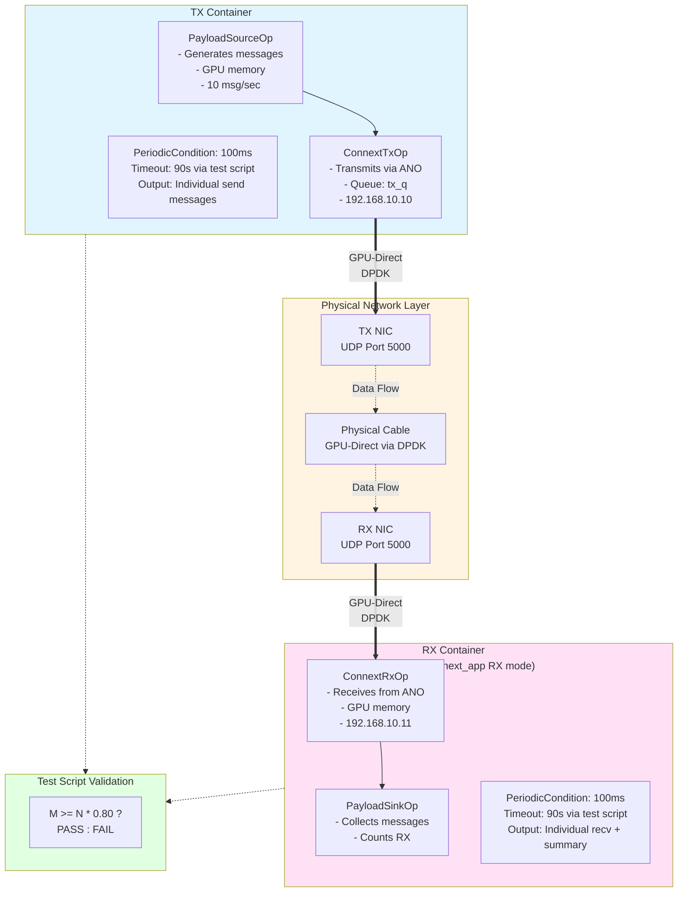
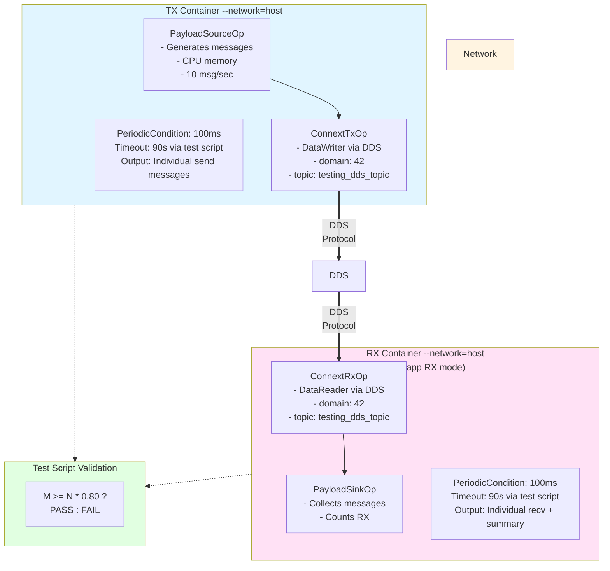

# Connext End-to-End Tests

This directory contains end-to-end tests for the Connext application supporting both **Advanced Network Operator (ANO)** and **DDS** transports using **rate-based transmission** with timeout control.

## Overview

The tests validate both ANO and DDS communication in separate Docker containers:

- **ANO Tests**: Validate GPU-Direct RDMA communication using physical NICs with DPDK
- **DDS Tests**: Validate traditional DDS middleware communication using standard networking

Both test suites use the unified `connext_app` application in TX and RX modes with **PeriodicCondition** for continuous message transmission at a fixed rate.

## Table of Contents

- [Test Structure](#test-structure)
- [Prerequisites](#prerequisites)
  - [Common Requirements](#common-requirements-both-ano-and-dds)
  - [ANO-Specific Requirements](#ano-specific-requirements)
  - [DDS-Specific Requirements](#dds-specific-requirements)
- [Running Tests](#running-tests)
  - [ANO End-to-End Tests](#ano-end-to-end-tests)
    - [Automated ANO Test](#automated-ano-test-recommended)
    - [Test Flow](#test-flow)
    - [Manual Container Launch](#manual-container-launch)
  - [DDS End-to-End Tests](#dds-end-to-end-tests)
    - [Automated DDS Test](#automated-dds-test-recommended)
    - [DDS Test Flow](#dds-test-flow)
    - [Manual DDS Container Launch](#manual-dds-container-launch)
  - [Test Configuration Details](#test-configuration-details)
    - [ANO Test Configuration](#ano-test-configuration)
    - [DDS Test Configuration](#dds-test-configuration)
  - [Test Validation](#test-validation)
- [ANO vs DDS Comparison](#ano-vs-dds-comparison)
- [Troubleshooting](#troubleshooting)
  - [Common Issues](#common-issues-both-ano-and-dds)
  - [DDS-Specific Issues](#dds-specific-issues)
  - [ANO-Specific Issues](#ano-specific-issues)
  - [Debugging](#debugging)
- [Expected Output](#expected-output)
  - [ANO Test Output](#ano-test-output)
  - [DDS Test Output](#dds-test-output)
- [Architecture](#architecture)
  - [ANO Architecture](#ano-architecture)
  - [DDS Architecture](#dds-architecture)
- [Key Design Points](#key-design-points)
- [Notes](#notes)
- [Related Documentation](#related-documentation)


## Test Approach

**Rate-Based Testing:**
- TX sends messages continuously at 10 messages/second using `PeriodicCondition`
- Both TX and RX run for a fixed duration (90 seconds) controlled by Python test script
- Test validates that RX received at least 80% of the messages TX sent
- No CountCondition used (avoided due to blocking behavior with network packet loss)

## Test Structure

The test files are organized in the source directory and automatically copied to the build directory during compilation:

```
tests/
├── test_ano_e2e.py              # ANO test orchestrator
├── test_dds_e2e.py              # DDS test orchestrator  
├── test_utils.py                # Shared utilities
├── README.md                     # This file
├── scripts/                      # Shell scripts
│   ├── run_e2e_rx_container.sh           # ANO RX container launcher
│   ├── run_e2e_tx_container.sh           # ANO TX container launcher
│   ├── run_e2e_dds_rx_container.sh       # DDS RX container launcher
│   └── run_e2e_dds_tx_container.sh       # DDS TX container launcher
└── config/                       # YAML configurations
    ├── test_ano_rx.yaml                  # ANO RX configuration
    ├── test_ano_tx.yaml                  # ANO TX configuration
    ├── test_dds_rx.yaml                  # DDS RX configuration
    └── test_dds_tx.yaml                  # DDS TX configuration
```

**Note:** After building with `./holohub build connext_app_cpp`, all test files are copied to:
```
build/connext_app_cpp/applications/connext/connext_app_cpp/cpp/tests
```
with the same directory structure (`scripts/` and `config/` subdirectories).

### ANO Tests (GPU-Direct with Physical NICs)
Configuration files in `config/`:
- **`test_ano_tx.yaml`** - ANO TX configuration with DPDK and GPU memory
- **`test_ano_rx.yaml`** - ANO RX configuration with DPDK and GPU memory

Shell scripts in `scripts/`:
- **`run_e2e_tx_container.sh`** - Script to launch ANO TX container
- **`run_e2e_rx_container.sh`** - Script to launch ANO RX container

Python orchestrator:
- **`test_ano_e2e.py`** - ANO test orchestrator (90s duration)

### DDS Tests (Standard Network Transport)
Configuration files in `config/`:
- **`test_dds_tx.yaml`** - DDS TX configuration with CPU memory
- **`test_dds_rx.yaml`** - DDS RX configuration with CPU memory

Shell scripts in `scripts/`:
- **`run_e2e_dds_tx_container.sh`** - Script to launch DDS TX container
- **`run_e2e_dds_rx_container.sh`** - Script to launch DDS RX container

Python orchestrator:
- **`test_dds_e2e.py`** - DDS test orchestrator (90s duration)

### Common
- **`test_utils.py`** - Shared utilities for both test suites

## Prerequisites

### Common Requirements (Both ANO and DDS)

1. **Build the application:**
   ```bash
   ./holohub build connext_app_cpp --build-type debug|release --configure-args="-DCONNEXTDDS_ARCH=armv8Linux4gcc7.3.0" --configure-args="-DBUILD_TESTING:BOOL=ON"
   ```

2. **RTI License:**
   - RTI Connext DDS license file (`rti_license.dat`)
   - Set via environment variable:
     ```bash
     export RTI_LICENSE_FILE="./rti_license.dat"  # Optional, default location
     ```

### ANO-Specific Requirements

3. **Physical NICs (ANO only):**
   - Two physical NICs connected via cable or network switch
   - PCIe addresses for both NICs (use `lspci | grep Ethernet`)
   - DPDK-compatible NICs
   - Hugepages configured for DPDK

4. **Environment Variables (ANO only):**
   ```bash
   export TEST_TX_NIC_PCIE="0005:03:00.0"  # Your TX NIC PCIe address
   export TEST_RX_NIC_PCIE="0005:03:00.1"  # Your RX NIC PCIe address
   ```

### DDS-Specific Requirements

5. **Network Configuration (DDS only):**
   - Standard network connectivity between containers
   - No special hardware required

---
# Running Tests

## ANO End-to-End Tests

Tests for GPU-Direct DPDK communication using Advanced Network Operator with physical NICs.

### Automated ANO Test (Recommended)

Run the ANO test orchestrator from the build directory:

```bash
cd /path/to/holohub/build/connext_app_cpp/applications/connext/connext_app_cpp/cpp/tests
export TEST_TX_NIC_PCIE="0005:03:00.0"
export TEST_RX_NIC_PCIE="0005:03:00.1"
export RTI_LICENSE_FILE="./rti_license.dat"
python3 test_ano_e2e.py
```

**Note:** Replace `/path/to/holohub` with your actual workspace path (e.g., `/home/my-user/holohub`).

The script will:
1. Validate environment (NICs, license, scripts)
2. Launch RX container in background
3. Wait 5 seconds for RX initialization
4. Launch TX container in background
5. Run test for 90 seconds, then forcefully stop Docker containers
6. Parse outputs to count individual message transmissions:
   - TX: Count `PayloadSource sending payload:` messages
   - RX: Count `PayloadSink received payload:` messages
   - Fallback: Use `Receiver collected M payload(s)` summary or ANO confirmations
7. Validate: `M >= N * 0.80` (80% success threshold)

### Test Flow

```
Time    Action
────────────────────────────────────────────────────────────────
0s      Start RX container in background
        RX initializes ANO/DPDK, starts receiving
5s      Start TX container in background
        TX initializes ANO/DPDK
        TX begins sending at 10 msg/sec
        RX receives messages continuously
90s     Test script forcefully stops Docker containers
        Outputs collected and parsed
        
Expected: ~850 messages sent (85s × 10 msg/sec)
Expected: ~680-850 messages received (80-100% success rate)
Validation: RX_received >= TX_sent * 0.80 ✓ PASS
```

### Manual Container Launch

#### Terminal 1 - RX Container:
```bash
cd /path/to/holohub/build/connext_app_cpp/applications/connext/connext_app_cpp/cpp/tests
export TEST_TX_NIC_PCIE="0005:03:00.0"
export TEST_RX_NIC_PCIE="0005:03:00.1"
export RTI_LICENSE_FILE="./rti_license.dat"
./run_e2e_rx_container.sh
# Let it run, then Ctrl+C to stop after collecting enough data
```

#### Terminal 2 - TX Container (after RX initializes):
```bash
cd /path/to/holohub/build/connext_app_cpp/applications/connext/connext_app_cpp/cpp/tests
export TEST_TX_NIC_PCIE="0005:03:00.0"
export TEST_RX_NIC_PCIE="0005:03:00.1"
export RTI_LICENSE_FILE="./rti_license.dat"
sleep 5  # Wait for RX to initialize
./run_e2e_tx_container.sh
# Let it run, then Ctrl+C to stop
```

**Note:** For manual testing: the Python test script handles timing automatically. Manual launch is primarily for debugging.

---

## DDS End-to-End Tests

Tests for standard DDS middleware communication using CPU memory and standard networking (no physical NICs required).

### Automated DDS Test (Recommended)

Run the DDS test orchestrator from the build directory:

```bash
cd /path/to/holohub/build/connext_app_cpp/applications/connext/connext_app_cpp/cpp/tests
export RTI_LICENSE_FILE="./rti_license.dat"
python3 test_dds_e2e.py
```

**Note:** Replace `/path/to/holohub` with your actual workspace path (e.g., `/home/my-user/holohub`).

The script will:
1. Validate environment (RTI license, scripts, config files)
2. Launch RX container in background
3. Wait 10 seconds for RX initialization and DDS discovery
4. Launch TX container in background
5. Run test for 90 seconds, then forcefully stop Docker containers
6. Parse outputs to count individual message transmissions:
   - TX: Count `PayloadSource sending payload: integration_test_dds_payload_#N` messages
   - RX: Count `PayloadSink received payload: integration_test_dds_payload_#N` messages
   - Fallback: Use `Receiver collected M payload(s)` summary
7. Validate: `M >= N * 0.80` (80% success threshold)

### DDS Test Flow

```
Time    Action
────────────────────────────────────────────────────────────────
0s      Start RX container in background
        RX initializes DDS DataReader, waits for discovery
10s     Start TX container in background
        TX initializes DDS DataWriter
        DDS discovery matches DataWriter/DataReader
        TX begins sending at 10 msg/sec
        RX receives messages continuously
90s     Test script forcefully stops Docker containers
        Outputs collected and parsed
        
Expected: ~800 messages sent (80s × 10 msg/sec)
Expected: ~640-800 messages received (80-100% success rate)
Validation: RX_received >= TX_sent * 0.80 ✓ PASS
```

**Note:** DDS discovery takes longer (10s vs 5s for ANO), so expected message count is ~800 instead of ~850.

### Manual DDS Container Launch

#### Terminal 1 - RX Container:
```bash
cd /path/to/holohub/build/connext_app_cpp/applications/connext/connext_app_cpp/cpp/tests
export RTI_LICENSE_FILE="./rti_license.dat"
./run_e2e_dds_rx_container.sh
# Let it run, then Ctrl+C to stop after collecting enough data
```

#### Terminal 2 - TX Container (after RX initializes):
```bash
cd /path/to/holohub/build/connext_app_cpp/applications/connext/connext_app_cpp/cpp/tests
export RTI_LICENSE_FILE="./rti_license.dat"
sleep 10  # Wait for RX to initialize and DDS discovery
./run_e2e_dds_tx_container.sh
# Let it run, then Ctrl+C to stop
```

**Note:** For manual testing, the Python test script handles timing automatically. Manual launch is primarily for debugging.

---

# Test Configuration Details

## ANO Test Configuration

### TX Configuration (`test_ano_tx.yaml`)

Key parameters:
- **`demo.mode: tx`** - TX mode
- **`demo.message_period_ms: 100`** - Send every 100ms = 10 messages/second
- **`demo.discovery_wait_ms: 5000`** - Wait 5s for ANO/DPDK initialization
- **`payload_source.base_payload: integration_test_payload`** - Fixed test payload
- **`payload_source.use_gpu_memory: true`** - Use GPU memory for ANO

### RX Configuration (`test_ano_rx.yaml`)

Key parameters:
- **`demo.mode: rx`** - RX mode
- **`demo.message_period_ms: 100`** - Poll every 100ms
- **`payload_sink.expected_payload_prefix: integration_test_payload`** - Validate payload prefix

## DDS Test Configuration

### TX Configuration (`test_dds_tx.yaml`)

Key parameters:
- **`demo.mode: tx`** - TX mode
- **`demo.message_count: 0`** - Continuous mode (rate-based)
- **`demo.message_period_ms: 100`** - Send every 100ms = 10 messages/second
- **`demo.discovery_wait_ms: 5000`** - Wait 5s for DDS discovery
- **`payload_source.base_payload: integration_test_dds_payload`** - Fixed test payload
- **`payload_source.use_gpu_memory: false`** - Use CPU memory (DDS transport)
- **`connext_tx.enable_dds: true`** - Enable DDS transport
- **`connext_tx.enable_ano: false`** - Disable ANO
- **`connext_tx.domain_id: 42`** - DDS domain ID
- **`connext_tx.topic_name: testing_dds_topic`** - DDS topic name
- **`connext_tx.topic_type_name: HoloscanPayload`** - DDS type name

### RX Configuration (`test_dds_rx.yaml`)

Key parameters:
- **`demo.mode: rx`** - RX mode
- **`demo.message_count: 0`** - Continuous reception mode
- **`demo.message_period_ms: 100`** - Poll every 100ms
- **`payload_source.use_gpu_memory: false`** - Use CPU memory (DDS transport)
- **`payload_sink.expected_payload_prefix: integration_test_dds_payload`** - Validate payload prefix
- **`connext_rx.enable_dds: true`** - Enable DDS transport
- **`connext_rx.enable_ano: false`** - Disable ANO
- **`connext_rx.domain_id: 42`** - DDS domain ID (matches TX)
- **`connext_rx.topic_name: testing_dds_topic`** - DDS topic name (matches TX)
- **`connext_rx.topic_type_name: HoloscanPayload`** - DDS type name

---

# Test Validation

Both ANO and DDS tests use the same validation approach.

### TX Container Output
The test script counts individual `PayloadSource sending payload:` messages:
```
PayloadSource sending payload: integration_test_payload_#1
PayloadSource sending payload: integration_test_payload_#2
...
PayloadSource sending payload: integration_test_payload_#850
```

### RX Container Output  
The test script counts individual `PayloadSink received payload:` messages:
```
PayloadSink received payload: integration_test_payload_#1
PayloadSink received payload: integration_test_payload_#2
...
PayloadSink received payload: integration_test_payload_#720
```

Optionally, the final summary from `main.cpp`:
```
Receiver collected 720 payload(s).
```

### Test Script Validation

1. **Parse Outputs:** Count individual message occurrences using regex
   - **ANO:** `r"PayloadSource sending payload: integration_test_payload_#(\d+)"` (count matches)
   - **DDS:** `r"PayloadSource sending payload: integration_test_dds_payload_#(\d+)"` (count matches)
   - RX: Similar patterns for received messages
   - Fallback: `r"Receiver collected (\d+) payload\(s\)"` summary

2. **Calculate Success Rate:**
   ```python
   success_rate = (rx_received / tx_sent) * 100.0
   min_required = int(tx_sent * 0.80)  # 80% threshold
   ```

3. **Pass/Fail Criteria:**
   - **PASS:** `rx_received >= min_required`
   - **FAIL:** `rx_received < min_required`

### Example Validation

```
TX sent: 850 messages (last message #850)
RX received: 720 messages (last message #720)
Success rate: 84.7% (720/850)
Minimum required: 680 messages (80%)
✓ TEST PASSED - Received 720/680 minimum required
```

### Why 80% Threshold?

- Accounts for realistic network conditions (mainly startup time where RX runs but TX is still pending)
- Validates that bulk of messages are successfully transmitted
- Applies to both ANO and DDS tests (DDS uses reliable reliability so it expected to lose less samples, even zero, when ANO is best effort)

---

# ANO vs DDS Comparison

| Feature | ANO Tests | DDS Tests |
|---------|-----------|-----------|
| **Transport** | GPU-Direct via DPDK | Standard DDS middleware |
| **Hardware** | Physical NICs required | No special hardware |
| **Memory** | GPU memory | CPU memory |
| **Network** | Custom flow rules, UDP port 5000 | DDS discovery, multiple ports |
| **Container Mode** | Privileged, DPDK setup | Standard UDP |
| **Discovery Time** | 5 seconds (ANO init) | 10 seconds (DDS discovery) |
| **Expected Messages** | ~850 (85s active) | ~800 (80s active) |
| **Use Case** | High-performance, low-latency | Standard distributed systems |
| **Configuration** | `test_ano_tx/rx.yaml` | `test_dds_tx/rx.yaml` |
| **Scripts** | `run_e2e_tx/rx_container.sh` | `run_e2e_dds_tx/rx_container.sh` |
| **Test Script** | `test_ano_containers_simple.py` | `test_dds_e2e.py` |

**When to use ANO:** High-throughput, low-latency requirements with GPU-Direct RDMA support

**When to use DDS:** Standard networking, no special hardware, broader compatibility

---

# Troubleshooting

## Common Issues (Both ANO and DDS)

### Container Fails to Start

**Symptom:** Container exits immediately

**Solutions:**
- Check RTI license file exists and is valid
- Verify build completed successfully
- Check Docker is running: `sudo docker ps`

### No Messages Sent

**Symptom:** TX shows 0 messages sent

**Solutions:**
- Check application started properly
- Verify config file exists and is valid
- Check for initialization errors in container output

### DDS-Specific Issues

### DDS Discovery Fails

**Symptom:** TX sends messages but RX receives 0 messages

**Solutions:**
- Verify both containers use same `domain_id` (42)
- Verify both containers use same `topic_name` (testing_dds_topic)
- Check firewall rules allow DDS traffic (multiple UDP ports)
- Verify containers can communicate via network
- Try `--network=host` mode (should be default in run scripts)

### ANO-Specific Issues

### ANO Container Fails to Start

**Symptom:** Container exits immediately or fails to initialize DPDK

**Solutions:**
- Verify NIC PCIe addresses: `lspci | grep Ethernet`
- Check hugepages: `cat /proc/meminfo | grep Huge`
- Ensure NICs are not bound to kernel driver during test
- Check RTI license file exists and is valid

### ANO: No Messages Received

**Symptom:** ANO TX sends but RX receives 0 messages

**Solutions:**
- Verify NICs are connected (cable or switch)
- Check firewall/routing (containers use bridge network)
- Verify UDP port 5000 in flow rules matches config
- Check IP addresses in YAML configs (192.168.10.10 ↔ 192.168.10.11)
- Verify MAC addresses match your NICs

### Test Fails Below Threshold

**Symptom:** RX receives messages but below 80% threshold

**Common Solutions (Both):**
- Check system load during test
- Verify containers had enough time to initialize
- Check test script timeout settings

**ANO-Specific Solutions:**
- Check for packet drops in DPDK stats
- Increase batch size or timeout in advanced_network config
- Verify CPU core assignments don't conflict
- Verify network cable connection quality
- Check for firewall or routing issues

**DDS-Specific Solutions:**
- Increase DDS QoS history depth
- Check DDS transport settings
- Verify network bandwidth sufficient
- Check for packet loss with `netstat -s`

### GPU Memory Errors (ANO Only)

**Symptom:** CUDA allocation or copy errors

**Solutions:**
- Verify CUDA is available: `nvidia-smi`
- Check GPU memory: `nvidia-smi -q -d MEMORY`
- Ensure container has GPU access (--gpus all)
- Verify hugepages for GPU direct: `/dev/hugepages` mounted

## Debugging

### View Container Logs

The test script shows stdout/stderr. For manual debugging:

```bash
# List running containers
sudo docker ps

# View logs for specific container
sudo docker logs <container-id>

# Follow logs in real-time
sudo docker logs -f <container-id>
```

### Enable Debug Logging

**For ANO tests** - Modify `test_ano_tx.yaml` or `test_ano_rx.yaml`:
```yaml
advanced_network:
  cfg:
    log_level: "debug"  # Change from "info"
    debug: true         # Enable debug output
```

**For DDS tests** - Set environment variable before running:
```bash
export NDDS_QOS_PROFILES=/path/to/debug_qos.xml
```

Or add to YAML config:
```yaml
connext_tx:  # or connext_rx
  enable_dds: true
  # Add DDS-specific debug flags as needed
```

### Check DPDK Status (ANO Only)

Inside container:
```bash
# List DPDK devices
dpdk-devbind.py --status

# Check hugepages
cat /proc/meminfo | grep Huge
```

### Check DDS Status (DDS Only)

Inside or outside container:
```bash
# Check DDS domain participants
ps aux | grep connext

# Monitor DDS traffic (if rtiddsspy available)
rtiddsspy -domainId 42

# Check network connectivity
ping <container-ip>
netstat -tulpn | grep 7400  # DDS default discovery port
```

## Expected Output

### ANO Test Output

#### TX Container Success:
```
PayloadSource sending payload: integration_test_payload_#1
PayloadSource sending payload: integration_test_payload_#2
PayloadSource sending payload: integration_test_payload_#3
...
PayloadSource sending payload: integration_test_payload_#850
```

#### RX Container Success:
```
PayloadSink received payload: integration_test_payload_#1
PayloadSink received payload: integration_test_payload_#2
PayloadSink received payload: integration_test_payload_#3
...
PayloadSink received payload: integration_test_payload_#720
Receiver collected 720 payload(s).
```

#### Test Script Output:
```
================================================================================
Validating Environment
================================================================================

✓ TX NIC PCIe: 0005:03:00.0
✓ RX NIC PCIe: 0005:03:00.1
✓ RTI License: ./rti_license.dat
✓ Container scripts found

================================================================================
Starting ANO End-to-End Test
================================================================================

Test parameters:
  - Timeout: 90 seconds
  - Expected rate: ~10 messages/second
  - Expected TX count: ~850 messages (85s active transmission)
  - Success threshold: 80.0%

Starting RX container...
[RX output...]

Starting TX container...
[TX output...]

================================================================================
Parsing Results
================================================================================

✓ TX sent: 850 messages (last message #850)
✓ RX received: 720 messages (last message #720)

================================================================================
Validation
================================================================================

Success rate: 84.7% (720/850)
Minimum required: 680 messages (80.0%)
✓ TEST PASSED - Received 720/680 minimum required

================================================================================
✓ TEST PASSED
================================================================================
```

### DDS Test Output

#### TX Container Success:
```
PayloadSource sending payload: integration_test_dds_payload_#1
PayloadSource sending payload: integration_test_dds_payload_#2
PayloadSource sending payload: integration_test_dds_payload_#3
...
PayloadSource sending payload: integration_test_dds_payload_#800
```

#### RX Container Success:
```
PayloadSink received payload: integration_test_dds_payload_#1
PayloadSink received payload: integration_test_dds_payload_#2
PayloadSink received payload: integration_test_dds_payload_#3
...
PayloadSink received payload: integration_test_dds_payload_#680
Receiver collected 680 payload(s).
```

#### Test Script Output:
```
================================================================================
Validating Environment
================================================================================

✓ RTI License: ./rti_license.dat
✓ Container scripts found
✓ Config files found

================================================================================
Starting DDS End-to-End Test
================================================================================

Test parameters:
  - Timeout: 90 seconds
  - Expected rate: ~10 messages/second
  - Success threshold: 80.0%
  - Transport: DDS (domain_id=42, topic=testing_dds_topic)

Starting RX container in background...
Waiting 10 seconds for RX initialization and DDS discovery...
Starting TX container in background...
Running test for 90 seconds...
(Containers will be terminated after timeout)

[Output from both containers...]

================================================================================
Parsing Results
================================================================================

✓ TX sent: 800 messages (last message #800)
✓ RX received: 680 messages (last message #680)

================================================================================
Validation
================================================================================

Success rate: 85.0% (680/800)
Minimum required: 640 messages (80.0%)
✓ TEST PASSED - Received 680/640 minimum required

================================================================================
✓ TEST PASSED
================================================================================
```

## Architecture

### ANO Architecture



### DDS Architecture



## Key Design Points

### Common to Both Tests

### Common to Both Tests

1. **Rate-Based Transmission:**
   - TX sends continuously at fixed rate (10 msg/sec)
   - No CountCondition blocking on message count
   - Runs until external timeout terminates process

2. **PeriodicCondition Only:**
   - Both TX and RX use `PeriodicCondition` for timing
   - Avoids blocking issues with CountCondition
   - More robust with network packet loss

3. **Timeout Control:**
   - Python test script runs containers for 90 seconds
   - Forcefully stops Docker containers using `docker stop`
   - Ensures test completes even if network issues occur
   - Collects stdout/stderr for validation

4. **External Validation:**
   - Operators print each message transmission to stdout
   - Test script counts individual messages using regex
   - Fallback to summary output or ANO confirmations
   - Validation logic in test script, not operators
   - Flexible threshold adjustment without rebuilding

### ANO-Specific

5. **Separate DPDK Resources:**
   - TX container: `/var/run/dpdk_tx`
   - RX container: `/var/run/dpdk_rx`
   - Avoids resource conflicts between containers

6. **GPU Memory:**
   - Uses CUDA memory for zero-copy DMA
   - Requires GPU-Direct RDMA capable NICs

### DDS-Specific

7. **Standard Networking:**
   - Uses host network stack (--network=host)
   - No privileged mode required
   - No special hardware needed

8. **DDS Discovery:**
   - Automatic peer discovery via multicast
   - 10-second initialization to allow discovery
   - Uses standard DDS QoS policies

## Notes

### Common Notes

- **Why rate-based instead of count-based?**
  - CountCondition blocks until expected messages arrive
  - With network packet loss, CountCondition can hang indefinitely
  - Rate-based with timeout ensures test always completes
  - More realistic for production network scenarios

- **Why PeriodicCondition only?**
  - Provides consistent timing for message generation
  - Doesn't block on external conditions
  - Works reliably with continuous transmission mode (`message_count: 0`)

- **Why 80% threshold instead of 90%?**
  - Accounts for initialization time and startup delays
  - Allows for more realistic packet loss scenarios
  - Still validates that majority of messages transmitted successfully
  - Can be adjusted in test script without rebuilding

- **Payload format:**
  - ANO: `integration_test_payload_#N` where N is incremental
  - DDS: `integration_test_dds_payload_#N` where N is incremental
  - RX validates prefix only
  - Full payload not validated to simplify testing

### ANO-Specific Notes

- **Why separate DPDK directories?**
  - DPDK uses shared memory and lock files in runtime directory
  - Multiple DPDK processes sharing same directory causes conflicts
  - Separate directories (`dpdk_tx`, `dpdk_rx`) isolate resources
  - Essential for multi-container testing

- **ANO Timing breakdown:**
  - 0-5s: RX initialization (ANO/DPDK setup)
  - 5-90s: TX initialization + active transmission (~85s × 10 msg/s = ~850 messages)
  - 90s: Test script forcefully stops Docker containers
  - Outputs collected and parsed for message counts
  - No `stop()` method output needed - messages counted from stdout

### DDS-Specific Notes

- **Why 10-second initialization for DDS?**
  - DDS discovery uses multicast and takes time
  - DataReader and DataWriter must discover each other
  - Longer than ANO (5s) which doesn't need discovery
  - Ensures reliable connection before transmission starts

- **DDS Timing breakdown:**
  - 0-10s: RX initialization + DDS discovery
  - 10-90s: TX initialization + active transmission (~80s × 10 msg/s = ~800 messages)
  - 90s: Test script forcefully stops Docker containers
  - Outputs collected and parsed for message counts

- **Why --network=host for DDS?**
  - DDS uses multicast for discovery
  - Multiple UDP ports for user data and meta-traffic
  - Host networking simplifies container-to-container communication
  - Avoids Docker bridge network complexity

## Related Documentation

- [Connext Application README](../README.md)
- [Holohub Connext Operators](../../../../operators/connext/README.md)
- [Advanced Network Operator Documentation](../../../../gxf_extensions/advanced_network/README.md)
