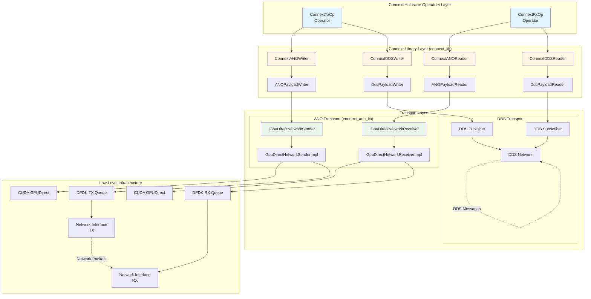
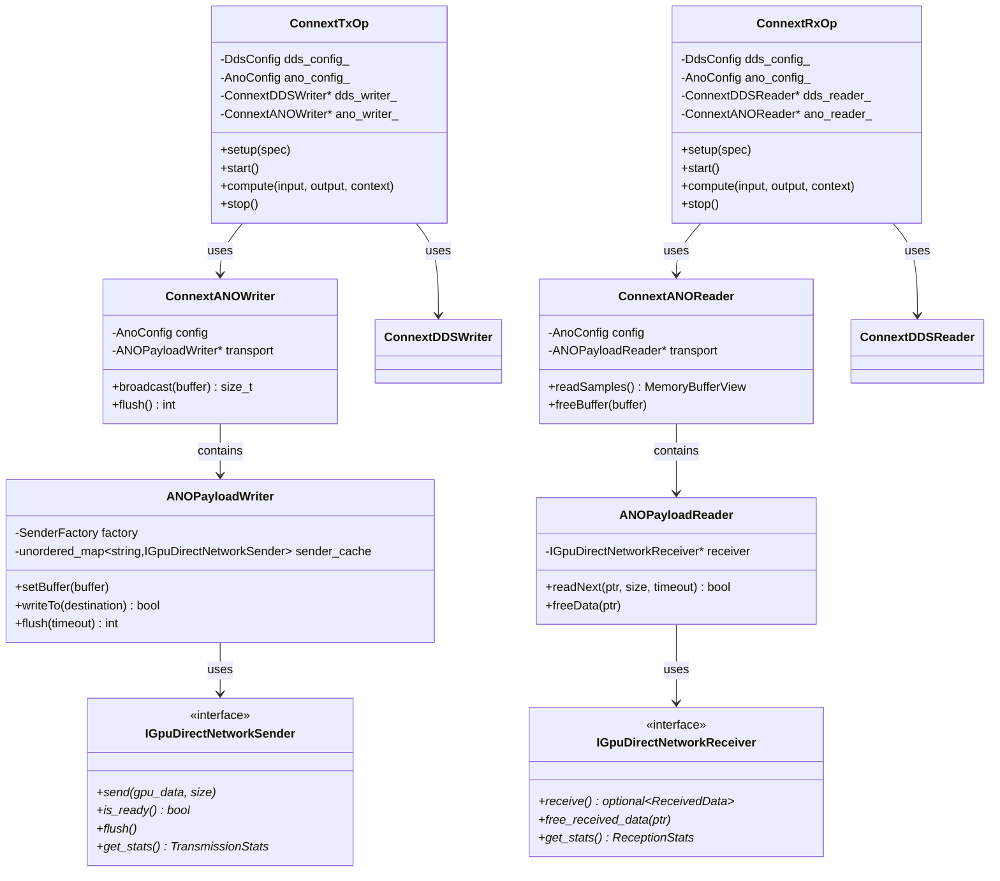
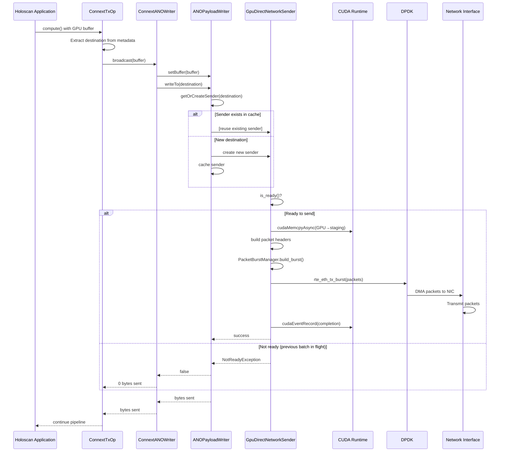
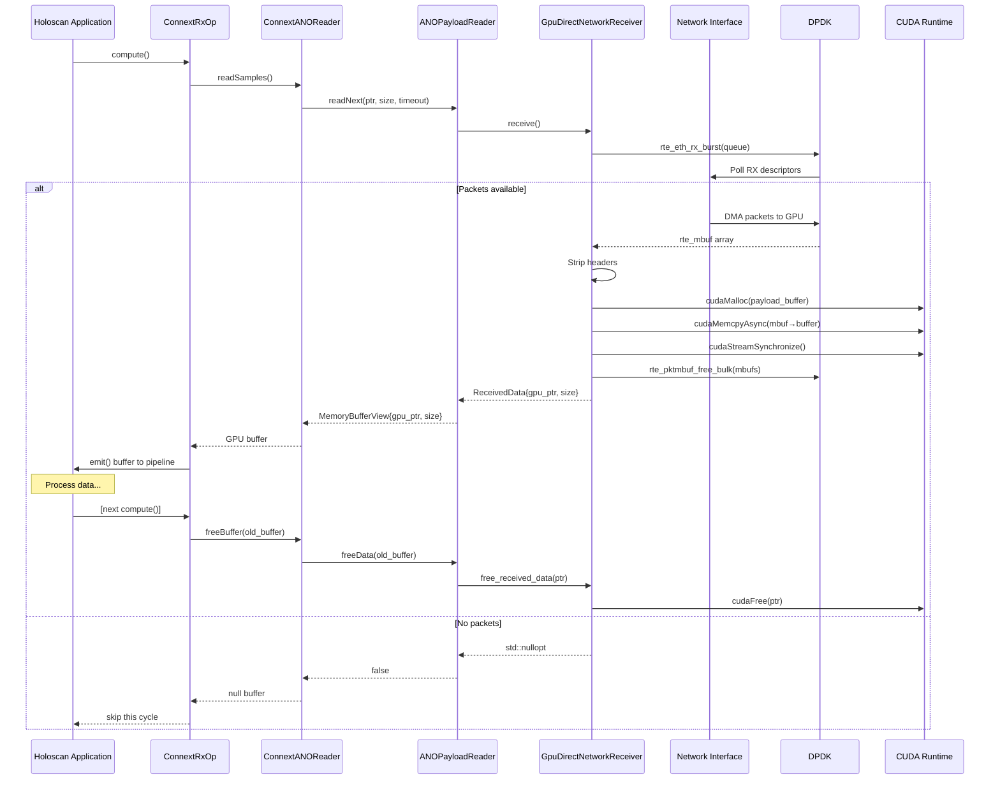

# Connext Operators and Library

The `operators/connext` directory hosts two complementary components that enable RTI Connext DDS integrations on the
Holoscan platform:

- **`connext_lib`** – A reusable C++ support library that bundles DDS and ANO resource management.
- **`connext_ano_lib`** – A GPU Direct networking facade library providing high-level abstractions for zero-copy network transmission and reception using DPDK and CUDA. Offers dual send modes (IMMEDIATE/BATCH), manual flush control, and single-queue receiver for deterministic packet routing.
- **`connext_ops`** – C++ transmit/receive operators (`ConnextTxOp` and `ConnextRxOp`) that integrate with Holoscan pipelines.

## Architecture

This section provides an overview of the system architecture, component relationships, and data flow patterns.

### High-Level System Architecture



### Key Components

#### 1. **Connext Operators** (`connext_ops`)
Holoscan-native operators that integrate into application pipelines:
- **ConnextTxOp**: Transmits data from Holoscan pipeline to network
- **ConnextRxOp**: Receives data from network into Holoscan pipeline
- Support dual transport modes (DDS + ANO) configurable at runtime
- Handle GPU/CPU memory management and buffer lifecycle

#### 2. **Connext Library** (`connext_lib`)
Core communication abstractions:
- **Resource Management**: DDS participants, topics, readers, writers
- **Transport Abstraction**: Unified interface for DDS and ANO transports
- **Configuration**: Validates and manages DDS/ANO settings
- **Discovery**: Automatic endpoint discovery via DDS for ANO routing

#### 3. **ANO GPU Direct Library** (`connext_ano_lib`)
Low-level GPU Direct networking:
- **Zero-Copy Transmission**: GPU → NIC via CUDA GPUDirect
- **Zero-Copy Reception**: NIC → GPU via CUDA GPUDirect
- **DPDK Integration**: Hardware-accelerated packet I/O
- **Packet Management**: Ethernet/IP/UDP header construction and parsing
- **Async CUDA Operations**: Event-based flow control for pipeline parallelism

### Class Diagram



### Transmission Sequence Diagram



### Reception Sequence Diagram



### Data Flow Patterns

#### ANO Transport (GPU Direct Path)
1. **Transmission**:
   - Data stays in GPU memory throughout the pipeline
   - CUDA GPUDirect copies GPU buffer → NIC DMA region (zero-copy)
   - DPDK transmits packets without CPU involvement
   - Async CUDA events track completion for pipeline parallelism

2. **Reception**:
   - NIC DMA writes packets directly to GPU memory (zero-copy)
   - DPDK polls RX queue and returns GPU-resident packets
   - Headers stripped, payload returned as GPU pointer
   - Application processes data on GPU, then frees buffer

#### DDS Transport (Standard Path)
1. **Transmission**:
   - GPU buffers copied to CPU if needed
   - DDS serialization and network stack
   - Standard TCP/UDP with QoS policies

2. **Reception**:
   - DDS receives and deserializes data
   - Data available in CPU memory
   - Copied to GPU if needed by downstream operators

### Memory Management Strategy

```mermaid
graph LR
    subgraph "Sender Side"
        A[Application GPU Buffer] -->|Reference| B[ANOPayloadWriter]
        B -->|Async Copy| C[Staging Buffer GPU]
        C -->|GPUDirect DMA| D[NIC TX Queue]
    end
    
    subgraph "Receiver Side"
        E[NIC RX Queue] -->|GPUDirect DMA| F[DPDK mbuf GPU]
        F -->|cudaMemcpyAsync| G[Payload Buffer GPU]
        G -->|Reference| H[ANOPayloadReader]
        H -->|emit| I[Application]
        I -->|freeBuffer| J[cudaFree]
    end
    
    D -.->|Network| E
    
    style A fill:#e3f2fd
    style C fill:#fff9c4
    style G fill:#fff9c4
    style I fill:#e3f2fd
```



**Key Principles**:
- **Zero-copy where possible**: GPU → NIC → GPU via GPUDirect
- **Caller-owned buffers**: Application manages input buffer lifetime
- **Receiver allocates**: Reader allocates new GPU buffer per received packet
- **Explicit cleanup**: Caller must call `freeBuffer()` to prevent leaks
- **Async operations**: CUDA streams/events enable pipeline parallelism

## Prerequisites

Before building any Connext component, make sure the following prerequisites are satisfied:
- RTI Connext DDS 7.3.0 SDK installed and `NDDSHOME` pointing at the SDK root (for example `/opt/rti/rti_connext_dds-7.3.0`).
- Valid RTI license file with `RTI_LICENSE_FILE` exporting the absolute path.
- CUDA runtime libraries by exporting `LD_LIBRARY_PATH=/usr/local/cuda/lib64:$LD_LIBRARY_PATH`.
- Holoscan Advanced Network Op have to be built. i.e: 
`./holohub build advanced_network --build-type debug --local --configure-args="-DCONNEXTDDS_ARCH=armv8Linux4gcc7.3.0"`

## Building

Both components are wired into the Holohub CMake build:

Ensure your environment exposes the RTI license file, NDDSHOME from the RTI Connext Debian packages, and CUDA runtime
libraries, for example:

```sh
export NDDSHOME=/opt/rti/rti_connext_dds-7.3.0
export RTI_LICENSE_FILE=/path/to/rti_license.dat
export LD_LIBRARY_PATH=/usr/local/cuda/lib64:$LD_LIBRARY_PATH
```

> The Debian installers published by RTI place the SDK under `/opt/rti/rti_connext_dds-7.3.0`. Point `NDDSHOME` at
> that directory and ensure the license file is reachable before building the DDS helpers—CMake will fail early if the
> SDK is missing.

### RTI license reminder

All Connext components require a valid RTI license. If you obtained the SDK through your organization, ask your RTI
administrator for the license file. Otherwise, visit the RTI Customer Portal to request an evaluation. Export
`RTI_LICENSE_FILE` before launching builds, tests, or sample applications.

### C++ helper library and operators

```sh
./holohub build connext_ano_lib connext_lib --build-type debug --local --configure-args="-DCONNEXTDDS_ARCH=armv8Linux4gcc7.3.0" --configure-args="-DOP_advanced_network=ON"

or 

cmake -B build -DCMAKE_BUILD_TYPE=Debug -DBUILD_TESTING=ON -DOP_advanced_network=ON -DCONNEXTDDS_ARCH=armv8Linux4gcc7.3.0
cmake --build build --target connext_ano_lib connext_lib connext_ops
ctest --test-dir build -R connext -V
```

- `connext_lib` and `connext_ano_lib` emit static archives plus headers/metadata so future native operators can link against stable interfaces.
- Test targets:
  - `connext_ano_unit_tests` – Unit tests for connext_ano_lib (config validation, network utils, packet builder)
  - `connext_ano_component_tests` – Component tests requiring GPU (CUDA resource manager, RAII wrappers)
  - `test_tx_rx_loopback` – Integration test for GPU Direct TX/RX over loopback (requires DPDK + Advanced Network)
  - `test_tx_rx_physical` – Integration test for GPU Direct TX/RX over physical NICs
  - `connext_lib_cpp_tests` – Unit tests for connext_lib (DDS tests, config tests, payload transport tests)
- Running `ctest -R connext` runs all connext tests. Use `ctest -R connext_ano` to run only connext_ano_lib tests.

## Configuration for ANO (GPU Direct) Transport

When using ANO transport with Holoscan Advanced Network operators, the receiver may pick up unintended UDP traffic from other applications on the network (e.g., DDS discovery packets, system broadcasts, or other network services). This manifests as "garbage" data being received alongside legitimate Connext packets.

### Recommended Solution: DPDK Flow-Based Filtering

The most efficient solution is to configure **DPDK flows** to filter packets by UDP source and destination ports at the hardware level. This eliminates unwanted traffic before it reaches the application, providing zero CPU overhead.

#### Configuration Example

In your **sender** configuration (e.g., `connext_sender.yaml`):

```yaml
connext_tx:
  ano_fast_port: 5000  # UDP port used for transmission
```

In your **receiver** configuration (e.g., `connext_receiver.yaml`):

```yaml
advanced_network:
  cfg:
    interfaces:
    - name: "rx_interface"
      address: "0005:03:00.1"
      rx:
        flows:
        - name: "connext_flow"
          action:
            type: "queue"
            id: 0
          match:
            udp_src: 5000  # Match sender's UDP port
            udp_dst: 5000  # Match receiver's UDP port
        queues:
        - name: "rx_q_0"
          id: 0
          # ... other queue config

connext_rx:
  ano_fast_port: 5000  # Must match the flow configuration
```

#### Why This Works

- **Hardware filtering**: Packets are filtered by the NIC before reaching the CPU
- **No false positives**: Only packets matching the exact UDP port criteria are received
- **Standard practice**: DPDK flow API is designed for high-performance packet filtering
- **Zero application overhead**: No need for software-based packet validation

### Future Consideration: Application-Level Validation

> **Note**: For environments where hardware-level filtering is not possible or additional validation is desired, 
> application-level packet validation using magic headers or packet signatures could be implemented. This would 
> add a validation layer in the operator's compute method to verify packet authenticity before processing. 
> However, this approach incurs CPU overhead and is less efficient than hardware filtering. 
> This remains a potential enhancement for future development if use cases emerge that require it.